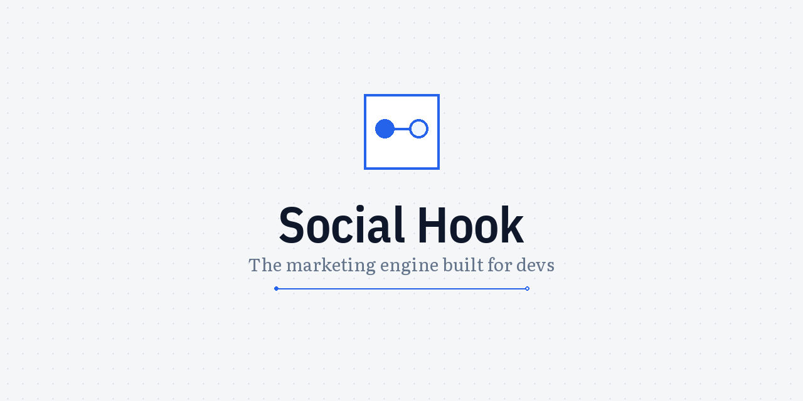

<p align="center">
  
</p>

<h1 align="center">Social Hook</h1>

[](https://github.com/nj-io/social-hook/actions/workflows/ci.yml)
[](https://codecov.io/gh/nj-io/social-hook)
[](https://pypi.org/project/social-hook/)
[](https://www.python.org/downloads/)
[](LICENSE)

Automated social media content from development activity.

Social Hook is a [Claude Code](https://docs.anthropic.com/en/docs/claude-code) hook that observes your git commits, evaluates which ones are interesting, drafts social media posts, and routes them through Telegram or a web dashboard for human approval before posting.

## How It Works

1. **Evaluate** — A `PostToolUse` hook fires on each git commit. An AI evaluator decides if the commit is post-worthy.
2. **Draft** — Post-worthy commits get drafted into platform-specific content (X/Twitter, LinkedIn, etc.) using your voice and project context.
3. **Approve** — Drafts surface in Telegram or the web dashboard. You edit, approve, reject, or schedule.
4. **Post** — Approved drafts are posted to configured platforms via their APIs.

## Agent-First Design

Social Hook is built for both humans and AI agents:

- `social-hook help --json` — full command tree as structured JSON for agent consumption
- `social-hook help draft approve` — drill into any subcommand (human or `--json`)
- Every CLI command has a corresponding web API endpoint (and vice versa)
- All commands work non-interactively with `--json` output and `--yes`/`--force` flags

## Quick Start

```bash
# Install
pip install -e .

# Initialize (creates config directory and database)
social-hook init

# Interactive setup wizard
social-hook setup

# Start the web dashboard
social-hook web
```

### Claude Code Hook

Add to your Claude Code hooks configuration (`.claude/hooks.json`):

```json
{
  "hooks": {
    "PostToolUse": [
      {
        "matcher": "Bash",
        "command": "social-hook trigger --tool-use \"$TOOL_USE\" --session-id \"$SESSION_ID\" --cwd \"$CWD\""
      }
    ]
  }
}
```

## CLI

The CLI is self-documenting — `social-hook help` for humans, `social-hook help --json` for agents. Drill into any level: `social-hook help draft approve`.

Core commands:

```
social-hook trigger        # Evaluate a commit (called by hook)
social-hook web            # Start web dashboard (Next.js + FastAPI)
social-hook bot start      # Start Telegram bot daemon
social-hook setup          # Interactive configuration wizard
social-hook project list   # List registered projects
social-hook draft list     # List pending drafts
social-hook arc list       # List narrative arcs
social-hook snapshot save  # Save/restore/reset DB snapshots
social-hook test evaluate  # Test commit evaluation
```

## E2E Testing

The E2E test suite exercises full user workflows with real API calls. Entry point: `scripts/e2e_test.py`.

```bash
python scripts/e2e_test.py --provider claude-cli                     # Full suite
python scripts/e2e_test.py --only onboarding                         # Single section
python scripts/e2e_test.py --only A1                                 # Single scenario
python scripts/e2e_test.py --save-snapshots --provider claude-cli    # Save DB after each section
python scripts/e2e_test.py --only draft --snapshot after-pipeline    # Load saved state, skip A+B
```

See `scripts/e2e_test.py --help` for all options.

## Web Dashboard

```bash
social-hook web                    # Start on default ports (3000 + 8741)
social-hook web --port 4000        # Custom Next.js port
social-hook web --api-port 9000    # Custom API port
social-hook web --install          # Run npm install first
```

The dashboard provides draft review, project management, arc management, and real-time notifications via WebSocket.

## Configuration

Social Hook uses a two-level config system:

- **Global config** (`~/.social-hook/config.yaml`) — API keys, platform credentials, LLM provider settings
- **Project config** (`.social-hook/` in your repo) — `social-context.md` (project voice/context), `content-config.yaml` (content rules)

See `examples/` for config templates.

## Multi-Provider LLM

Social Hook supports multiple LLM providers via a `provider/model-id` format:

- `anthropic/claude-sonnet-4-5` — Anthropic API (default)
- `claude-cli/sonnet` — Claude Code subprocess
- `openrouter/anthropic/claude-sonnet-4.5` — OpenRouter
- `ollama/llama3.3` — Local Ollama

## Contributing

See [CONTRIBUTING.md](CONTRIBUTING.md) for development setup, running checks, and PR guidelines.

## Versioning

Social Hook uses [Semantic Versioning](https://semver.org/). Releases are automated via [Release Please](https://github.com/googleapis/release-please) — conventional commits on `main` trigger version bumps, changelog generation, and PyPI publishing.

## License

[MIT](LICENSE)
